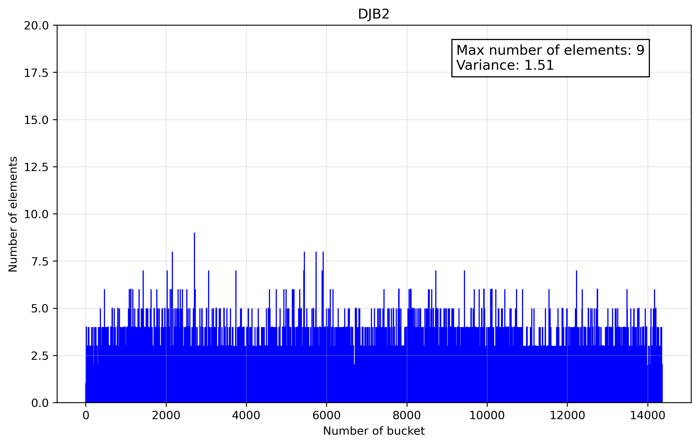

# Hash Table


## Review

Hash table is a data structure that implements an associative array. It works by using a hash function to compute an index where the value is stored. A good hash function minimizes collisions and works fast.

Load factor - characteristic of hash tables, equals (NUMBER_OF_ELEMENTS) / (NUMBER_OF_BUCKETS). A good load factor ~ 0.5-0.7 but we will use ~1.5 to make our optimizations more visible.

**Hash table collision resolution techniques:**

 - **Chaining:** each bucket contains a linked list. We will use this technique
 - **Open Addressing:** all elements are stored directly in the hash table array. If a collision occurs, the algorithm searches for the next available slot using a specified algorithm (probing)
 - **Perfect Hashing:** the hash function ensures that there are no collisions (all lookups take O(1) worst-case time)
 - **Cuckoo Hashing:** each key has two possible hash locations. If both are occupied, the existing key is "kicked out" and reinserted into its alternate location

## Hash functions research

We will use Leo Tolstoy's work **"War and Peace"** (21540 different words). Number of buckets - 14363 (load factor ~ 1.5)

Let's consider some hash functions:

### Length

Hash is length of key


The histogram is expanded along the x-axis for better visibility.

You may see that the function does not meet our needs at all

### ASCII

Hash is the sum of the symbols ASCII codes


Not much better

### Position

Hash is the sum of each symbol multiplied by its position


A little better, but still bad

### DJB2

DJB2 hash function



Much better than all previous functions

### CRC32

CRC32 hash function, the polynomial 0x82F63B78


The result is the same as DJB2

### Result

Function     |Variance
:-----------:|:-------
Length       | 3700.83
ASCII        | 49.96
Position     | 13.40
DJB2         | 1.51
CRC32        | 1.52

In future work, we will use CRC32 function because it has an assembly instruction which can be useful during optimization

## Profiling

We will use valgrind 3.22.0 for profiling (kcachegrind 23.08.5 for visualization).


Thus, the main hotspots are the CRC32 function and strcmp()

### Ideas:

 - Use **Intrinsics** or **assembly instructions** for CRC32 function and strcmp()
 - Optimize input data (**alignment**)

 ### Using Intrinsics for CRC32 function

 ```bash
    uint32_t __CRC32(const char* key, int length)
{
    const uint8_t* key8 = (const uint8_t*) key;

    uint32_t crc = 0xFFFFFFFF;

    while (length && ((uintptr_t) key8 & 7))
    {
        crc = _mm_crc32_u8(crc, *key8);

        key8++;
        length--;
    }

    const uint64_t* key64 = (const uint64_t*) key8;

    while (length >= 8)
    {
        crc = (uint32_t) _mm_crc32_u64(crc, *key64);

        key64++;
        length -= 8;
    }

    key8 = (const uint8_t*) key64;

    while (length--)
    {
        crc = _mm_crc32_u8(crc, *key8);
        key8++;
    }

    return crc ^ 0xFFFFFFFF;
```

 

**WOW!** IT WORKS!
